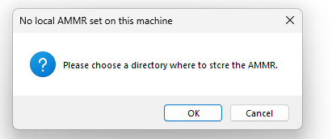

(example-gallery)=
# Application examples

In the repository, you can find musculoskeletal applications from a wide area of
interests. These models are demonstrate features from the AnyBody Modeling System and the AMMR body models.
Some of the models are donated by AnyBody users and now maintained as part of AMMR by AnyBody Technology.

:::::{only} anylink

::::{dropdown}  Click {.no-image-click w="1.5em" } to open models in AnyBody
:color: danger
:icon: download

**Note:** The first time click the you will be prompted to extract/install a local copy of the model repository (AMMR).

Next, select the parent folder where AMMR should be extracted. For example your documents folder.

:::
::::

:::::

(adl_examples)=
## Daily activities and ergonomics

:::{toctree}
:hidden: true

Daily-activities-and-ergonomics/index
:::

:::{include} Daily-activities-and-ergonomics/gallery.txt
:::

(mocap_examples)=
## Motion Capture and gait analysis

:::{toctree}
:hidden: true

Mocap/index
:::

:::{include} Mocap/gallery.txt
:::

(ortho_and_rehab_examples)=

## Orthopedics and rehabilitation

:::{toctree}
:hidden: true

Orthopedics_and_rehab/index
:::

:::{include} Orthopedics_and_rehab/gallery.txt
:::

(sports_examples)=

## Sports

:::{toctree}
:hidden: true

Sports/index
:::

:::{include} Sports/gallery.txt
:::

(other_examples)=
## Other

:::{toctree}
:hidden: true

Other/index
:::

:::{include} Other/gallery.txt
:::

(validation_examples)=

## Validation

:::{toctree}
:hidden: true

Validation/index
:::

:::{include} Validation/gallery.txt
:::

(beta_examples)=

## Beta

:::{toctree}
:hidden: true

Beta/index
:::

:::{include} Beta/gallery.txt
:::
