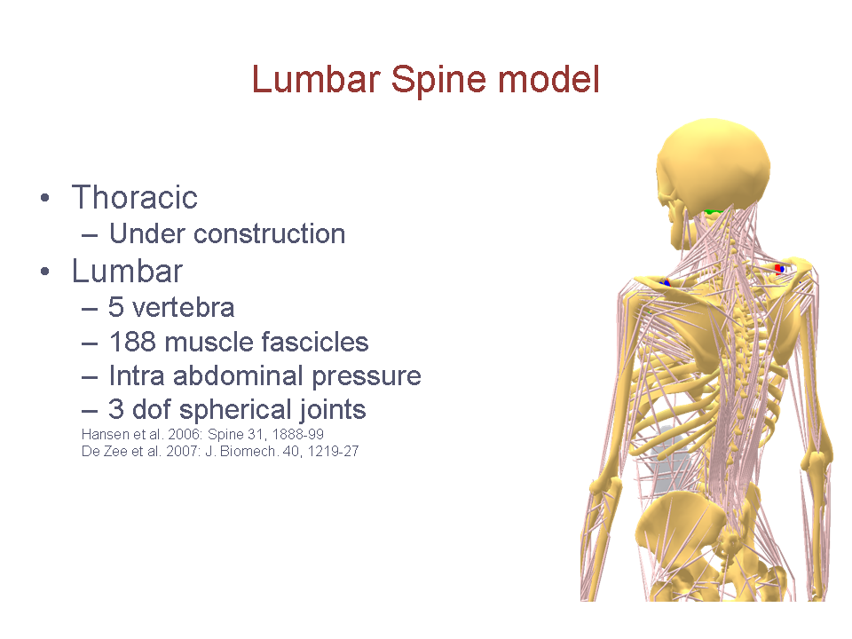
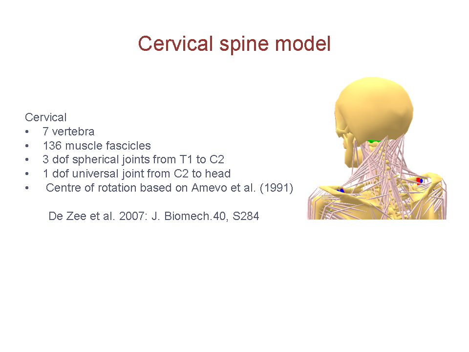

The Body Models
===============

The **Body** section contains necessary folders and files to assemble a
generic human body model. In most cases, it is not necessary (and not
recommended) to edit files directly in this body folder, as the models
can be modified to individual needs in your application. This section
also includes tools to connect the body model to the environment, or to
drive the model with motion capture data.

At top level in the Body section, you find body model collections. The
division here is historical depending on the origin of the models. By
far the more important is the AAUHuman, which contains the AnyBody
well-known full body model. It was originally developed at Aalborg
University, Denmark (with the acronym AAU) but it consists of body-parts
(trunk and extremities), which are either developed elsewhere or based
on data sets from elsewhere. At Århus University, Denmark, a mandible
model was developed, but so far never assembled with the AAUHuman. This
is still found in its original location the AUHuman folder. The Beta
section contains less developed and tested models.

This tutorial is focused on the human models. This lesson will give an
overview of how to use the AAUHuman and AUHuman Body Models and what can
be edited. More details on how to change the body model can be found in
various other tutorials.

The different body parts from the full body model are derived from
various anatomical databases from literature. The full body model
contains a mandible, shoulder/arm, different leg, trunk and foot models
that can run in several possible combinations. Please notice that all
parts of the AAUHuman (i.e., all parts except the mandible) are
connected, so they together form a quite complete full body model.

The Mandible Model
------------------

The mandible model is based on CT scans of a ”normal” face of a
30-year-old male. It contains 24 hill-type muscles and 4 DoF. It was
developed by Dr. Mark de Zee at Aarhus University, Denmark and
`published <http://www.anybodytech.com/downloads/publications/?fwd=publications#zee2007>`__
and presented at several scientific meetings.

|Image:mandible.png|

References:

-  Mark de Zee, Michel Dalstra, Paolo M Cattaneo, John Rasmussen, Peter
   Svensson, Birte Melsen (2007). Validation of a musculo-skeletal model
   of the mandible and its application to mandibular distraction
   osteogenesis. Journal of Biomechanics, 40, 1192–1201.

The Shoulder Arm Model
----------------------

This model contains data from two different persons. Most of the data
that has been used in this model comes from the Dutch Shoulder Group and
can be found on the following webpage
http://homepage.tudelft.nl/g6u61/repository/shoulder/overview.htm . The
model is built using data from subject 2 from the VU study and subject 2
from the MAYO study. The files, which contains the name "forearm", are
built on data from the MAYO study

A shoulder rhythm is available in the repository it can be switched on
and off, for full details on its implementation please see this report
`Shoulder Rhythm
Report <https://www.anybodytech.com/download.html?did=publications.files&fname=ShoulderRhythmReport.pdf>`__.

*The model consists of the following joints:*

-  SC SternoClavicular: spherical joint

-  AC AcromioClavicular: spherical joint

-  GH Glenohumeral joint: spherical (normal reactions of the spherical
   joint is not used instead they are created so that they fall within
   the glenoid cavity the file, please see the file GHReactions.any for
   details)

-  AI One dimensional constraint between the scapula and the thorax at
   the bonylandmark AI om scapula

-  AA One dimensional constraint between the scapula and the thorax at
   the bonylandmark AA om scapula

-  ConoideumLigament : the length of this segment is driven to a
   constant length

-  FE Flexion-extension of the elbow: revolute joint

-  PS pronation-supination joint or the forearm: combination of joints
   in distal and proximal end of the radius bone that leaves one dof
   free which is pronation/supination of the forearm

-  Wrist joint: created as two revolute joints where the axis of
   rotations are not coincident

|Image:arm.png|

*Anatomy references:*

-  F.C.T. van der Helm and R. Veenbaas, Modeling the mechanical efect of
   muscles with large attachment sites: aplication to the shoulder
   mechanism. Journal of Biomechanics, vol. 24, no. 12, pp. 1151-1163,
   1991

-  H.E.J. Veeger, F.C.T. van der Helm, L.H.V. van der Woude, G.M. Pronk
   and R.H. Rozendal, Inertia and muscle contraction parameters for
   musculoskeletal modelling of the shoulder mechanism. Journal of
   Biomechanics, vol. 24, no. 7, pp. 615-629, 1991

-  F.C.T. van der Helm, A finite element musculoskeletal model of the
   shoulder mechanism. Journal of Biomechanics, vol. 27, no. 5, pp.
   551-569, 1994

-  R. Happee and F.C.T. Van der Helm, The control of shoulder muscles
   during goal directed movements, an inverse dynamic analysisJ.
   Biomechanics, vol. 28, no. 10, pp. 1179-1191, 1995

-  Van der Helm FC, Veeger HE, Pronk GM, Van der Woude LH, Rozendal RH.
   Geometry parameters for musculoskeletal modeling of the shoulder
   system Journal of biomechanics Vol. 25 no. 2, pp. 129-144, 1992 Note:
   this reference is used for the geometry used for the definition of
   many of the geometries which are used for muscle wrapping

-  DirkJan (H.E.J.) Veeger, Bing Yu, Kai Nan An, Orientation of axes in
   the elbow and forearm for biomechanical modeling Proceedings of the
   first conference of the ISG,1997

-  The segment coordinatesystem are according to the ISB proposal,
   please see
   http://internationalshouldergroup.org/files/standards97.pdf

-  H.E.J. Veeger, Bing Yu, Kai-Nan An and R.H. Rozendal, Parameters for
   modeling the upper extremity, Journal of Biomechanics, Vol. 30, No.
   6, pp. 647-652, 1997

-  H.E.J. Veeger, F.C.T. van der Helm, L.H.V. van der Woude, G.M. Pronk
   and R.H. Rozendal,Inertia and muscle contraction parameters for
   musculoskeletal modelling of the shoulder mechanism. Journal of
   Biomechanics, vol. 24, no. 7, pp. 615-629, 1991

*Muscle references:*

-  Jacobson, M. D., R. Raab, B. M. Fazeli, R. A. Abrams, M. J. Botte,
   and R. L. Lieber. Architectural design of the human intrinsic hand
   muscles. J. Hand Surg. [Am.] 17:804809, 1992.

-  Lieber, R. L., M. D. Jacobson, B. M. Fazeli, R. A. Abrams, and M. J.
   Botte. Architecture of selected muscles of the arm and forearm:
   Anatomy and implications for tendon transfer. J. Hand Surg. [Am.]
   17:787-798, 1992.

-  Lieber, R. L., B. M. Fazeli, and M. J. Botte. Architecture of
   selected wrist flexor and extensor muscles. J. Hand Surg. [Am.]
   15:244-250, 1990.

-  Muray, W.M.,T.S. Buchanan, and S.L. Delp. Scaling of peak moment arms
   with the elbow and forearm position J. Biomech. Vol. 28, pp. 513-525,
   1995

The Lumbar Spine Model
----------------------

The Lumbar spine contains 5 vertebrae with 3 DoF spherical joints in
between, 188 muscle fascicles and intra-abdominal pressure.

|Image:spine.png|

The functional spinal units (FSU) are driven using a prescribed
kinematic rhythm, and by default, facet joints are not employed due to
the fact that most of the application do not focus on the lumbar spine
section. However, several examples demonstrate possible mechanisms of
facet joint incorporation and detailed modeling of the lumbar spine. The
spinal muscles do not include the force-length-velocity relations (i.e.
we use the so-called simple muscle model). The only input parameter in
the muscle model is the cross-sectional area multiplied by a factor.
Daggfeldt and Thorstensson (J.Biomech. 2003, 36: 815-825) didn't include
the force-length-velocity relations either. The inclusion of the lumbar
spine ligaments is optional and can be done as cumulative stiffness of
FSU or as separate elastic elements. Similarly, the intervertebral disc
(IVD) stiffness can be used as a single cumulative value for a FSU or as
linear and nonlinear functions for the disc only. This, however, is
mostly utilized for the spine specific applications, where the level of
detail is important. In other cases, it has been shown that the torque
production from ligaments might not be very important (Cholewicki and
McGill, J.Biomech. 1992, 25: 17-28). The data of vertebrae dimensions
and whole body parameters is taken from: Nissan and Gilad (J.Biomech.
19: 753-758, 1986) and mechanical properties of ligaments were taken
from: Pintar et al. (J.Biomech. 25(11): 1351-1356, 1992).

The spine model contains a preliminary model of the Intra Abdominal
pressure (IAP). In short the IAP is modeled as constant volume, which,
when squeezed from the side by the transversus muscles extends the spine
by pushing on the rib thorax and the pelvic floor. From the mathematical
point-of-view, this lets the abdominal muscles function as spine
extensors, and they become part of the whole recruitment problem. The
limit of the IAP was set to 26600 Pa, which was based on measurements on
well-trained subjects (Essendrop, M., 2003. Significance of
intra-abdominal pressure in work related trunk-loading. Ph.D. Thesis,
National Institute of Occupational Health, Denmark.) and using
geometric/anatomic estimates of pressure surface area and area
centroids, which in turn determines the effective moment arm of the
pressure.

More details on the lumbar spine model can be found online:

-  Presentation about the `Abdominal pressure
   Presentation <https://www.anybodytech.com/download.html?did=publications.files&fname=AbdominalPressureModel.pdf>`__

-  **Webcast `A lumbar spine model with facets joints and a dynamic
   stabilization
   device  <https://www.anybodytech.com/anybody.html?fwd=webcasts#20101221>`__**\ (Sebastian
   Dendorfer, 21. December, 2010). This presentation will bring an
   insight to added features and methods available in Anybody Modelling
   System using a lumbar spine example. First, we will shown a
   computational prediction of spine curvature and show the effect of
   the muscles on human posture. Secondly, this approach will be
   employed to highlight the effect of different designs of spinal
   fixation devices. Moreover, an overview of how to apply this
   modelling strategy in conjunction with two different formulations of
   the facet joints will be given.

-  Webcast `Implementation of facet joints in a lumbar spine model (Mark
   de Zee, 25. September,
   2008). <https://www.anybodytech.com/downloads/documentation/#2008925>`__
   This work presents a new methodology for implementation of facet
   joints in the lumbar spine model developed by De Zee et al. (2007: J
   Biomech. 40, 1219-1227). It enables the facet joint forces to become
   part of a redundant system of equilibrium equations for the entire
   system including the muscles. This redundant system is subsequently
   solved uniquely thereby making it possible to analyze the effect of
   whole body movements and loads on facet joint loading for the whole
   lumbar spine together with its muscles.

-  Webcast `A detailed rigid-body cervical spine model based on inverse
   dynamics (Dr. Mark de Zee, 18. September,
   2007) <https://www.anybodytech.com/anybody.html?fwd=webcasts#2007918>`__
   This webcast presents a detailed model of the cervical spine, which
   was presented at the ISB congress in Taipei. We will go through the
   model and its assumptions including the muscles and a preliminary
   validation. Moreover an application will be presented where we try to
   predict neuromuscular adaptation of experimentally induced neck pain
   using the cervical spine model. (The webcast is available for
   playback.)

-  Webcast `A generic detailed rigid-body lumbar spine model (Dr. Mark
   de Zee, 4. December,
   2006) <https://www.anybodytech.com/anybody.html?fwd=webcasts#2006124>`__
   This webcast presents a detailed model of the lumbar spine, which has
   been published in the Journal of Biomechanics. We will go through the
   model and its assumptions including the muscles, intra-abdominal
   pressure and validation. With the presented model it will be possible
   to investigate a range of research questions, because the model is
   relatively easy to share and modify, available in the public domain
   repository. (The webcast is available for playback.)

-  PowerPoint presentation `Spine Rhythm Presentation (PDF with videos
   click to activate
   them) <https://www.anybodytech.com/download.html?did=publications.files&fname=Spinerhythm.pdf>`__

You can read more about this lumbar spine model and some preliminary
validation in the following article:

-  de Zee, M., L. Hansen, C. Wong, J. Rasmussen, and E.B. Simonsen. A
   generic detailed rigid-body lumbar spine model. J.Biomech. 40:
   1219-1227, 2007.

*References:*

-  Andersson,E., Oddsson,L., Grundstrom,H.,Thorstensson,A., The role of
   the psoas and iliacus muscles for stability and movement of the
   lumbar spine, pelvis and hip, Scand. J. Med. Sci. Sports,5 (1995)
   10-16.

-  Bogduk,N., Clinical anatomy of the lumbar spine and sacrum, Churchill
   Livingstone, Edinburgh, 1997.

-  Bogduk,N., Macintosh,J.E., Pearcy,M.J., A universal model of the
   lumbar back muscles in the upright position, Spine, 17 (1992)
   897-913.

-  Bogduk,N., Pearcy,M.J., Hadfield,G., Anatomy and biomechanics of
   psoas major, Clin. Biomech., 7 (1992) 109-119.

-  Daggfeldt,K., Thorstensson,A., The role of intraabdominal pressure in
   spinal unloading, J. Biomech., 30 (1997) 1149-1155.

-  Daggfeldt,K., Thorstensson,A., The mechanics of back-extensor torque
   production about the lumbar spine, J. Biomech., 36 (2003) 815-825.

-  Heylings,D.J.A., Supraspinous and interspinous ligaments of the human
   lumbar spine, J. Anat., 125 (1978) 127-131.

-  Hodges,P.W., Cresswell,A.G., Daggfeldt,K., Thorstensson,A., In vivo
   measurement of the effect of intra-abdominal pressure on the human
   spine, J. Biomech., 34 (2001) 347-353.

-  Macintosh,J.E., Bogduk,N., The biomechanics of the lumbar multifidus,
   Clin. Biomech., 1 (1986) 205-213.

-  Macintosh,J.E., Bogduk,N., 1987 Volvo award in basic science. The
   morphology of the lumbar erector spinae, Spine, 12 (1987) 658-668.

-  Macintosh,J.E., Bogduk,N., The attachments of the lumbar erector
   spinae, Spine, 16 (1991) 783-792.

-  Macintosh,J.E., Bogduk,N., Munro,R.R., The morphology of the human
   lumbar multifidus, Clin. Biomech., 1 (1986) 196-204.

-  McGill,S.M., Norman,R.W., Effects of an anatomically detailed erector
   spinae model on L4/L5 disc compression and shear, J. Biomech., 20
   (1987) 591-600.

-  Pearcy,M.J., Bogduk,N., Instantaneous axes of rotation of the lumbar
   intervertebral joints, Spine, 13 (1988) 1033-1041.

-  Penning,L., Psoas muscle and lumbar spine stability: a concept
   uniting existing controversies. Critical review and hypothesis, Eur.
   Spine J., 9 (2000) 577-585.

-  Prestar,F.J., Putz,R., Das Ligamentum longitudinale posterius -
   morphologie und Funktion, Morphol. Med., 2 (1982) 181-189.

-  Prilutsky,B.I., Zatsiorsky,V.M., Optimizationbased models of muscle
   coordination, Exerc. Sport Sci. Rev., 30 (2002) 32-38.

-  Stokes,I.A., Gardner-Morse,M., Lumbar spine maximum efforts and
   muscle recruitment patterns predicted by a model with multijoint
   muscles and joints with stiffness, J. Biomech., 28 (1995) 173-186.

-  Stokes,I.A., Gardner-Morse,M., Quantitative anatomy of the lumbar
   musculature, J. Biomech., 32 (1999) 311-316.

-  Pintar et al., “Biomechanical properties of human lumbar spine
   ligaments”, J Biomech, Vol. 25(11), 1992, pp.1351-1356.

The Cervical Spine Model
------------------------

The cervical spine model contains 7 vertebrae with 3 DoF spherical
joints from T1 to C2, a 1 DoF joint between C2 and skull and 136 muscle
fascicles. The center of rotations is based on Amevo et al. 1991.

|Image:cervical.png|

More details can be found online at:

-  Data based on a neck model described by `Marike van der
   Horst <http://alexandria.tue.nl/extra2/200211336.pdf>`__

-  Webcast `A detailed rigid-body cervical spine model based on inverse
   dynamics (Dr. Mark de Zee, 18. September,
   2007) <https://www.anybodytech.com/anybody.html?fwd=webcasts#2007918>`__
   This webcast presents a detailed model of the cervical spine, which
   was presented at the ISB Congress in Taipei. We will go through the
   model and its assumptions including the muscles and preliminary
   validation. Moreover, an application will be presented where we try
   to predict neuromuscular adaptation of experimentally induced neck
   pain using the cervical spine model. (The webcast is available for
   playback.)

References:

-  de Zee, M., Falla, D., Farina, D. & Rasmussen, J. (2007), "A detailed
   rigid-body cervical spine model based on inverse dynamics", Journal
   of Biomechanics, vol. 40 (2), pp. S284.

The “LegTLEM” Model
-------------------

Implementation of a new lower extremity model labeled the Twente Lower
Extremity Model (TLEM) consisting of 159 muscles, and 6 joint degrees of
freedom is almost completed. It has been validated against ‘state of the
art’ literature with respect to its biomechanical performance and first
applications in gait and cycling deliver very convincing results.

The model is based on published morphological consistent anatomical
dataset on muscle and joint parameters by Martijn Klein-Horsman from the
University of Twente, The Netherlands. The implementation of the model
was started by Karin Gorter, a Master Student, also from the University
of Twente, during a three-month stay at Aalborg University and has been
finished by the AnyBody Technology.

The current version has been updated several times and is still being
maintained in collaboration with The AnyBody Research Group at Aalborg
University (DK) (www.anybody.aau.dk) and University of Twente (NL) under
the TLEMsafe project (`www.tlemsafe.eu <http://www.tlemsafe.eu>`__).
Currently, new cadaver datasets are recorded within the TLEMsafe
project.

|Image:tlem.png|

More details can be found online:

-  Report containing moment arm validation for `ESA:
   report <http://www.anybodytech.com/fileadmin/downloads/Final_Report.pdf>`__

-  Link to publication of the dataset: `Klein-Horsman et al.
   Morphological muscle and joint parameters for musculoskeletal
   modelling of the lower extremity. Clin Biomech, 2007, 22,
   239-247 <http://linkinghub.elsevier.com/retrieve/pii/S0268003306001896>`__

The “Leg” Model
---------------

The “leg” model was the first leg model to enter the AnyBody model
repository. It includes the pelvis, thigh, shank and a one segment foot.
The hip joint is modeled as a spherical joint, while the knee and ankle
are modeled as hinges. The “leg” model is equipped with only 35 muscles
elements, which makes it a far simpler model than the LegTLEM.

Thanks to Mark Thompson, Lund University Hospital, for his help in
developing the lower extremity model. A couple of muscles with broad
insertions (like the m. gluteus maximus) are divided into multiple
individual muscle units to represent the real geometry and the
mechanical actions of the muscle.

The parameters of these muscles are mainly based on the data published
by Delp and Maganaris

References:

-  S. Delp, Parameters for the lower limb, http://isbweb.org/data/delp/

-  Maganaris, C. N. In vivo measurement-based estimations of the moment
   arm in the human tibialis anterior muscle-tendon unit. Journal of
   Biomechanics, Vol. 33, pp. 375-379, 2000

-  Dostal, W. F. and J. G. Andrews. A three-dimensional biomechanical
   model of hip musculature. Journal of Biomechanics, Vol. 14, pp.
   803-812, 1981.

-  Herzog, W. and L. J. Read. Lines of action and moment arms of the
   major force-carrying structures crossing the human knee joint.
   Journal of Anatomy. Vol. 182:, pp. 213-230, 1993.

-  Hintermann, B., B. M. Nigg, and C. Sommer. Foot movement and tendon
   excursion: an in vitro study. Foot & Ankle International, Vol. 15,
   pp. 386-395, 1994

The Glasgow-Maastricht Foot Model (FootGM)
------------------------------------------

AnyBody Technology developed in corporation with Glasgow Caledonian
University and University of Maastricht inside the AFootprint EU project
a detailed multisegmental foot model, which is fully dynamic and
contains 26 segments representing all the foot bones, muscles,
ligaments, and joints connecting them. The model can be used with the
anatomy and recorded motion from different subjects. It has been
validated versus various other experimental and computational studies.

The foot model includes 26 rigid segments representing all the bones of
the human foot (except the sesamoid bones), namely: Talus, Calcaneus,
Cuboid, Navicular, Medial cuneiform, Intermediate cuneiform, Lateral
cuneiform, First metatarsal, Second metatarsal, Third metatarsal, Fourth
metatarsal, Fifth metatarsal, First proximal phalange, First distal
phalange, Second proximal phalange, Second medial phalange, Second
distal phalange, Third proximal phalange, Third medial phalange, Third
distal phalange, Fourth proximal phalange, Fourth medial phalange,
Fourth distal phalange, Fifth proximal phalange, Fifth medial phalange,
Fifth distal phalange.

It includes the following joints and kinematic constraints:
\ *Talocrural* \ *and Subtalar joint [20],* \ *Talonavicular joint,*
\ *Calcaneocuboid joint,* \ *Medialcuneonavicular joint,*
\ *Intermediate and lateral cuneonavicular joints,* \ *First
tarsometatarsal joint,* \ *Second, third and fourth tarsometatarsal
joints,* \ *Fifth tarsometatarsal joint,* \ *Metatarsophalangeal
joints,* \ *Interphalangeal joints,* \ *Toe flexion rhythm,*
\ *Intertarsal contact,* \ *Metatarsal head contact,* \ *Metatarsal
transverse arch,* \ *Tarsal transverse arch,* \ *Longitudinal medial
arch,* \ *Longitudinal lateral arch.*

The GM-Foot model includes following additional ligaments: Collateral
(tibiotalar anterior, tibiotalar posterior, tibiocalcaneal and
tibionavicular, and the lateral group constituted of the talofibular
anterior, talofibular posterior and talocalcaneal), Deep metatarsal
transverse, Plantar fascia, Long plantar, Calcaneo cuboid plantar,
Calcaneo navicular plantar, Tarsal ligaments ( Talonavicular dorsal,
Bifurcate, Calcaneocuboid dorsal, Cuneonavicular dorsal 1, 2 and 3,
Cuneonavicular plantar 1, 2 and 3, Intercuneiform dorsal 1 and 2,
Cuneocuboid dorsal, Intercuneiform plantar 1 and 2, Cuneocuboid plantar,
Cuboideonavicular dorsal, Cuboideonavicular plantar, Tarsometatarsal
dorsal 1 to 8, Tarsometatarsal plantar 1 to 7, Intermetatarsal dorsal 1,
2 and 3, Intermetatarsal plantar 1, 2 and 3) and Phalangeal ligaments

The muscles of the foot can be divided into two groups: the intrinsic
muscles and the extrinsic muscles. All the extrinsic muscles come from
the TLEM leg model of the AMMR. The intrinsic foot musculature is
constituted of the following muscles:

abductor hallucis (ABDH), flexor hallucis brevis medialis (FHBM) and
lateralis (FHBL), adductor hallucis transverse (ADHT) and oblique
(ADHO), abductor digiti minimi (ABDM), flexor digiti minimi brevis
(FDMB), dorsal interosseous (DI), plantar interosseous (PI), flexor
digitorum brevis (FDB), lumbricals (LB), quadratus plantar medialis
(QPM) and lateralis (QPL), extensor hallucis brevis (EHB), extensor
digitorum brevis (EDB)

More information can be found online:

-  **The new Glasgow-Maastricht AnyBody foot model** (Sylvain Carbes,
   20. September, 2012) \ `Presentation
   (2Mb) <http://www.anybodytech.com/download.html?did=webcasts.files&fname=AnyBodyWebcast-2012-09-20-FootModel.pdf&t=1&tt=wc>`__, \ `Playback
   (36Mb) <http://www.anybodytech.com/download.html?did=webcasts.files&fname=AnyBodyWebcast-2012-09-20-FootModel.wmv&t=1&tt=wc>`__
   This webcast presents a detailed AnyBody musculoskeletal foot model
   which includes all bones and joints of a real foot. Developed in
   collaboration with Glasgow Caledonian University and University
   Hospital Maastricht and referred to as the "Glasgow-Maastricht foot
   model" this model can be driven by motion capture data and uses
   combined force plate/pressure plate for accurate loading of the
   different joints. Built-in scaling allows the user to reproduce
   principal foot deformities such as flat foot and hallux valgus. The
   high detail level of the model and a built-in scaling protocol allows
   the user to investigate a wide range of parameters like joints motion
   and load, muscles activation, both in healthy and pathologic feet.

References used as input:

-  Arampatzis, S. et al., Strain and elongation of the human
   gastrocnemius tendon and aponeurosis during maximal plantarflexion
   effort. J Biomech, 38(4):833–841, Apr 2005.

-  Arndt, P. et al., Intrinsic foot kinematics measured in vivo during
   the stance phase of slow running. J Biomech, 40(12):2672–2678, 2007.

-  Bandholm, T et al., Foot medial longitudinal-arch deformation during
   quiet standing and gait in subjects with medial tibial stress
   syndrome. J Foot Ankle Surg, 47(2):89–95, 2008.

-  Bloome, DM et al., Variations on the insertion of the posterior
   tibialis tendon: a cadaveric study. Foot Ankle Int, 24(10):780–783,
   Oct 2003.

-  Cailliet, R. The Illustrated Guide to Functional Anatomy of the
   Musculoskel. Sys.. D J R Evans, 2004.

-  Cheung, JT et al., Three-dimensional finite element analysis of the
   foot during standing–a material sensitivity study. J Biomech,
   38(5):1045–1054, May 2005.

-  Fernandes, R. et al., Tendons in the plantar aspect of the foot: Mr
   imaging and anatomic correlation in cadavers. Skeletal Radiol,
   36(2):115–122, Feb 2007.

-  Funk, JR et al., Linear and quasi-linear viscoelastic
   characterization of ankle ligaments. J Biomech Eng, 122(1):15–22, Feb
   2000.

-  Kanatli, U. et al., Evaluation of the transverse metatarsal arch of
   the foot with gait analysis. Arch Orthop Trauma Surg, 123(4):148–150,
   May 2003.

-  Kitaoka, HB, et al., Mat properties of the plantar aponeurosis. Foot
   Ankle Int, 15(10):557–560, 1994.

-  Kura, H, et al., Quant. analysis of the intrinsic muscles of the
   foot. Anat Rec, 249(1):143–151,1997.

-  Lundberg and O.K. Svensson. The axes of rotation of the talocalcaneal
   and talonavicular joints. The Foot, 3(2):65 – 70, 1993.

-  Lundgren, P, et al., Invasive in vivo measurement of rear-, mid- and
   forefoot motion during walking. Gait Posture, 28(1):93–100, Jul 2008.

-  MacWilliams, BA, et al., Foot kinematics and kinetics during
   adolescent gait. Gait Posture, 17(3):214–224, Jun 2003.

-  Mengiardi, B, et al., Spring ligament complex: Mr imaging-anatomic
   correlation and findings in asymptomatic subjects. Radiology,
   237(1):242–249, Oct 2005.

-  Moraes do Carmo, CC, et al., Anatomical features of plantar
   aponeurosis: cadaveric study using ultrasonography and magnetic
   resonance imaging. Skeletal Radiol, 37(10):929–935, Oct 2008.

-  Netter, FH. Atlas der Anatomie des Menschen 3nd. Georg Thieme Verlag
   Stuttgart, 2003.

-  Pastore, D, et al., Complex distal insertions of the tibialis
   posterior tendon: detailed anatomic and mr imaging investigation in
   cadavers. Skeletal Radiol, 37(9):849–855, Sep 2008.

-  Patil, V. et al. Morphometric dimensions of the calcaneonavicular
   (spring) ligament. Foot Ankle Int, 28(8):927–932, Aug 2007.

-  Patil, V. et al., Anatomical variations in the insertion of the
   peroneus (fibularis) longus tendon. Foot Ankle Int, 28(11):1179–1182,
   Nov 2007.

-  Picard, M et al., orthopedic physical assessment 3rd edition (1997)
   wb saunders company,philadelphia 805 pp. 49.95. Journal of Hand
   Therapy, 11(4):286 –, 1998.

-  Siegler, S, et al., Mechanics of the ankle and subtalar joints
   revealed through a 3d quasi-static stress mri technique. J Biomech,
   38(3):567–578, Mar 2005.

-  Sooriakumaran, P and Sivananthan, S. Why does man have a quadratus
   plantae? a review of its comparative anatomy. Croat Med J,
   46(1):30–35, Feb 2005.

-  Stagni, R., et al., Ligament fibre recruitment at the human ankle
   joint complex in passive flexion. J Biomech, 37(12):1823–1829, Dec
   2004.

-  Taniguchi, A. et al., Anat. of the spring ligament. J Bone Joint Surg
   Am, 85-A(11):2174–2178, 2003.

-  Ward, KA and R. W. Soames. Morphology of the plantar calcaneocuboid
   ligaments. Foot Ankle Int, 18(10):649–653, Oct 1997.

-  Winson, IC., et al., Metatarsal motion. The Foot, 5(2):91 – 94, 1995.

-  Winson, IC., et al., Passive regulation of impact forces in heel-toe
   running. Clin Biomech (Bristol, Avon), 13(7):521–531, Oct 1998.

.. |Image:mandible.png| image:: image1.png
   :width: 3.46978in
   :height: 3.24000in

.. |Image:tlem.png| image:: image5.png
   :width: 5.69333in
   :height: 4.27000in