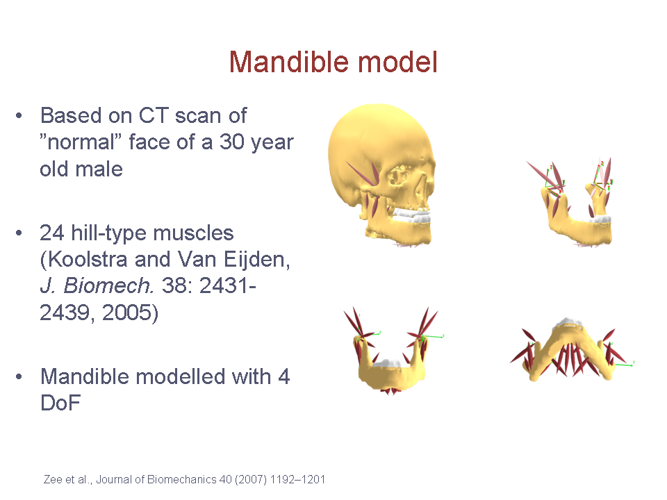

The Mandible Model
------------------

.. 
    Are there more stuff we can write about the mandle model. 
    I think we should also add more images. 

The mandible model is based on CT scans of a ”normal” face of a
30-year-old male. It contains 24 hill-type muscles and 4 DoF. It was
developed by Dr. Mark de Zee at Aarhus University, Denmark and
`published <http://www.anybodytech.com/downloads/publications/?fwd=publications#zee2007>`__
and presented at several scientific meetings.

.. todo::  Add a short example on how the mandible model is used and configured.

|Image:mandible.png|

References:

-  Mark de Zee, Michel Dalstra, Paolo M Cattaneo, John Rasmussen, Peter
   Svensson, Birte Melsen (2007). Validation of a musculo-skeletal model
   of the mandible and its application to mandibular distraction
   osteogenesis. *Journal of Biomechanics*, 40, 1192–1201.

