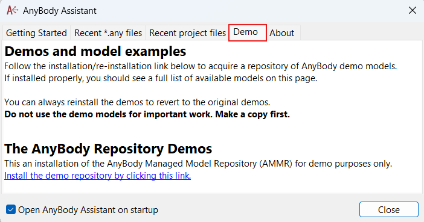

How to get the AMMR
-------------------

The newest version of the *AnyBody Model Repository* (AMMR) comes bundled with the 
AnyBody Modeling System. 

.. note:: The Repository files are not installed during the AnyBody installation
    because they must be available independently (not shared) for every user
    of the computer

To get a fresh copy of the AMMR select the "Demo" tab in the AnyBody Assistent
window that opens when AnyBody starts: 

Then select the "Install demo repository..."

..image:: _static/Installation-demo-repo.png

This will install the repository into your document folder (e.g.
``~/Documents/AnyBody.7.1.x/AMMR.v2.0.0-Demo``). Next make a copy 
these files before you start working. 

.. danger:: The AnyBody Modeling System also comes with a version of AMMR preinstalled in
    the installation directory [#f1]_. Do not use this repository for your
    actual work. It may be overwritten without warning when AnyBody is reinstalled. Instead,
    install your own copy with the AnyBody Assistent or manually make a copy
    into your document folder.

.. todo::

    Add Best practice for working with the AMMR. Eg. using Git for version control etc.

.. rubric:: Footnotes

.. [#f1] The preinstalled and (read only) AMMR is located in: ``C:/Program files/AnyBody Technology/AnyBody_X.X/AMMR`` 