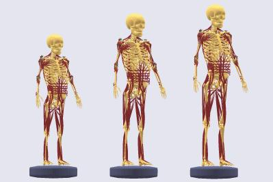

.. _scaling-intro:

Introduction to Scaling
=======================

Musculoskeletal models must be scalable to sizes of different
individuals to be useful for product design. Scaling pertains not only to the overall geometry, 
but also muscle insertion points, muscle parameters, wrapping
surfaces etc. AnyBody has a both generic and user-define scaling laws for models in the repository.

For details on scaling theory behind please take a look at the
following resource:
`*Abstract* <https://www.anybodytech.com/downloads/publications/#rasmussen2005e>`__.

Size related parameters of models in the `AMMR <../index.html>`__
are seldom defined as constant numbers, but instead computed from global measurements 
(e.g., total height, weight of human) based on a scaling law. Thus all body models
expect the definition of a scaling law, although user can 
choose the actual law. 

Currently there are nine pre-defined scaling laws available in AnyBody

.. rubric:: Scaling 

.. list-table:: Scaling laws
   :widths: 3 7
   :header-rows: 1

   * - Scaling law
     - Description
   * - :any:`ScalingStandard <_SCALING_STANDARD_>`
     - scale to a standard size; i.e. use 50th percentile sizes for a European male
   * - :any:`ScalingNone <_SCALING_NONE_>`
     - do not scale; i.e. use underlying cadaveric dataset as is
   * - :any:`ScalingUniform  <_SCALING_UNIFORM_>`
     - cale segments equally in all directions; input is joint to
       joint distances
   * - :any:`ScalingLengthMass <_SCALING_LENGTHMASS_>`
     - scale taking mass into account; input is joint to
       joint distances and mass
   * - :any:`ScalingLengthMassFat <_SCALING_LENGTHMASSFAT_>`
     - scale taking mass and fat into account; input
       is joint to joint distances
   * - :any:`ScalingUniformExt <_SCALING_UNIFORM_EXTMEASUREMENTS_>`
     - scale equally in all directions; input is external
       measurements
   * - :any:`ScalingLengthMassExt <_SCALING_LENGTHMASS_EXTMEASUREMENTS_>`
     - scale taking mass into account; input is external measurement
   * - :any:`ScalingLengthMassFatExt  <_SCALING_LENGTHMASSFAT_EXTMEASUREMENTS_>`
     - scale taking mass and fat into account; input is external measurements.
   * - :any:`ScalingXYZ  <_SCALING_XYZ_>`
     - scale taking mass and fat into account; scale segments along X, Y, Z axes;
       input is scale factors along X, Y, Z axes.

**Input parameters of scaling laws are specified in a file that is always named
AnyMan.any.** Several versions of this file are available, each for a different scaling law. 
More details can be found the in the tutorial below.

**Please also notice that each scaling law scales the strength of the
muscles, in addition to the size and mass of the bone.** This strength
scaling is done automatically in most cases. We will come back to it
when needed. Users who need a more comprehensive introduction can view
this recorded previous webcast titled `“Anthropometrical Scaling of
Musculoskeletal
Models” <http://www.anybodytech.com/downloads/documentation/#20090319>`__.

.. rubric:: Tutorial

The first five scaling methods are covered in Lesson 1. They are often
referred to as Joint to joint scaling methods. Lesson 2 covers the
next three which are based on external body measurement. And Lesson 3 covers
the ScalingXYZ scaling law, since the usage logic slightly differs from 
the rest of the laws.

With the AnyBody Modeling System you already have a repository of models
available, for details please see the AnyBody Assistant available from
the menu. As a starting point for this tutorial please find the model
StandingModelScalingDisplay. This model can be found in the folder
Applications/Examples.

.. toctree::
    :maxdepth: 1

    lesson1
    lesson2
    lesson3

.. rst-class:: without-title
.. seealso::
    **Next lesson:** Now head for :doc:`lesson1`.

