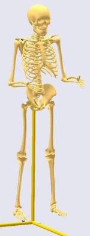
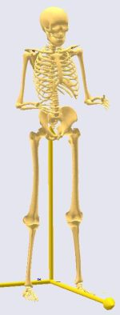
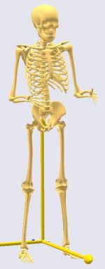
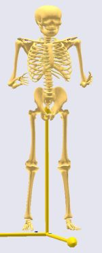
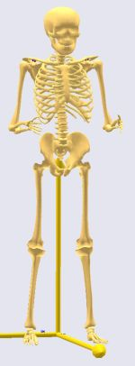
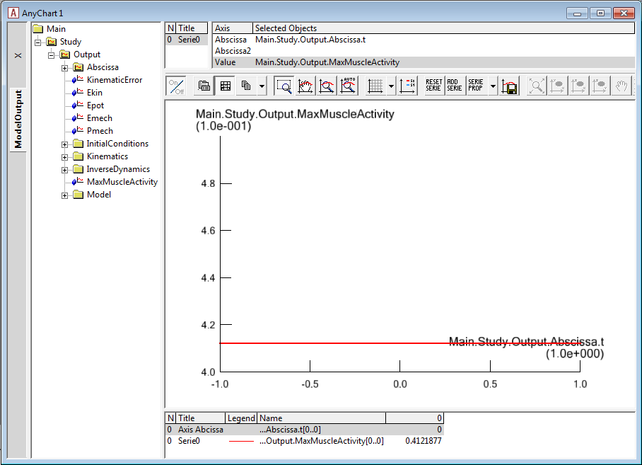
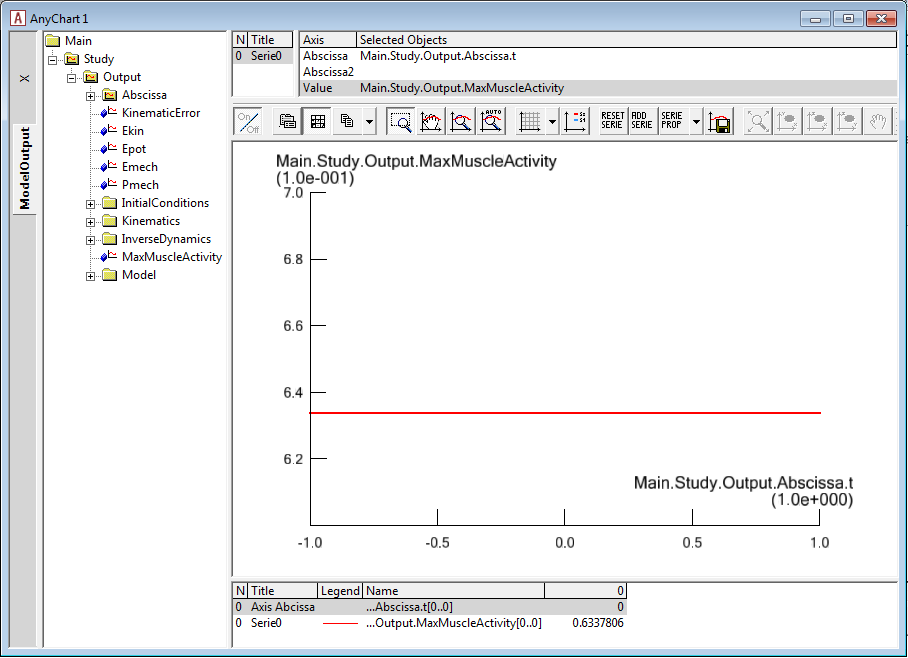
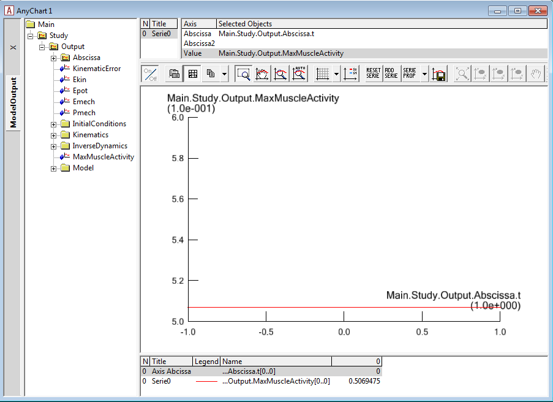
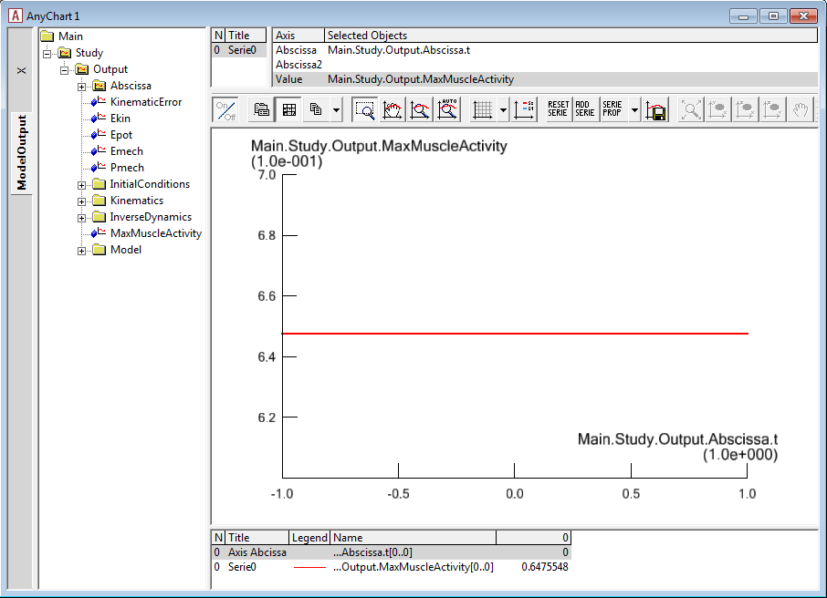

Lesson 1: Joint to Joint Scaling Methods
========================================

This lesson covers four of the scaling laws available in AnyBody:

-  ScalingStandard (do not scale)

-  ScalingUniform (scale equally in all directions; input is joint to
   joint distances)

-  ScalingLengthMass (scale taking mass into account; input is joint to
   joint distances and mass)

-  ScalingLengthMassFat (scale taking mass and fat into account; input
   is joint to joint distances)

ScalingStandard
---------------

This scaling law produces a model with default parameters for mass and
size (corresponding roughly to the 50th percentile European male). It is
used by default for non-specific models, or when there is no data
available about the modeled subject. This law does not use the AnyMan
file because there is no parameter to modify.

With the AnyBody Modeling System you already have a repository of models
available; for details please see the AnyBody Assistant available from
the menu. Let us practice, as a starting point for this tutorial, please
find the model:

Application/Examples/StandingModelScalingDisplay/StandingModelScalingDisplay.main.

This tutorial has been written using the AnyBody Managed Model
Repository Ver. 1.6 (AMMRV1.6), so you may see differences between the
tutorial and your own results.

To use this law you do not need to do anything at all; however, for
demonstration purposes scaling law configuration parameter (BM\_SCALING)
will be set to use the default value:

|ScalingStandardSize|

.. code-block:: AnyScriptDoc

    /*------------- SCALING CONFIGURATION SECTION --------------------*/
    // Actual scaling law
    §#define BM_SCALING CONST_SCALING_STANDARD§
    
    // Scaling laws using joint to joint measures
    //  #define BM_SCALING CONST_SCALING_UNIFORM
    //  #define BM_SCALING CONST_SCALING_LENGTHMASS
    //  #define BM_SCALING CONST_SCALING_LENGTHMASSFAT
    
    // Scaling laws using external measures
    //  #define BM_SCALING CONST_SCALING_UNIFORM_EXTMEASUREMENTS 
    //  #define BM_SCALING CONST_SCALING_LENGTHMASS_EXTMEASUREMENTS 
    //  #define BM_SCALING CONST_SCALING_LENGTHMASSFAT_EXTMEASUREMENTS 
    
    // Anthropometric data file (unchanged files can be found in AAUHuman\Scaling\AnyFamily)
    //  #path BM_SCALING_ANTHRO_FILE "Model\AnyFamily\AnyMan.any"
    //  #path BM_SCALING_ANTHRO_FILE "Model\AnyFamily\AnyManUniform.any"
    //  #path BM_SCALING_ANTHRO_FILE "Model\AnyFamily\AnyManExternal.any"
    //  #path BM_SCALING_ANTHRO_FILE "Model\AnyFamily\AnyManExtPercentile.any"
    //  #path BM_SCALING_ANTHRO_FILE "Model\AnyFamily\AnyWomanExtPercentile.any"
    //--------------- END OF SCALING CONFIGURATION ------------------- 

 Now load the model and open a Model View window. You will see the
  standing model with the standard size.

ScalingUniform
----------------

This law allows you to define the total weight of the model and the
individual sizes of the bones. The length of each bone is defined as a
joint to joint distance and the bone is then scaled in three dimensions
proportionally to its length. To use this law you must change the
scaling parameter to be CONST\_SCALING\_UNIFORM and set the
anthropometry file (BM\_SCALING\_ANTHRO\_FILE) to use an AnyMan.any
file. Please note this model contains a folder called AnyFamily, which
provides predefined anthropometric measurements. If you decide to reuse
this example for something else or to do this tutorial again – please
copy an unchanged version of the AnyFamily folder from the
AMMR\\AAUHuman\\Scaling\\AnyFamily:

.. code-block:: AnyScriptDoc

    /*------------- SCALING CONFIGURATION SECTION --------------------*/
    // Actual scaling law
    §//#define BM_SCALING CONST_SCALING_STANDARD§
    
    // Scaling laws using joint to joint measures
    §#define BM_SCALING CONST_SCALING_UNIFORM§
    //  #define BM_SCALING CONST_SCALING_LENGTHMASS
    //  #define BM_SCALING CONST_SCALING_LENGTHMASSFAT
    ...
    // Anthropometric data file (unchanged files can be found in AAUHuman\Scaling\AnyFamily)
    §#path BM_SCALING_ANTHRO_FILE "Model\AnyFamily\AnyMan.any"§
    //  #path BM_SCALING_ANTHRO_FILE "Model\AnyFamily\AnyManUniform.any"
    ...
    //--------------- END OF SCALING CONFIGURATION ------------------- 

AnyMan.any is the file in which you can modify the mass and size
parameters. We will now try to use it. Please load the model and have
a look at the Model View window. Notice that the body size did not
change from the standard scaling version. This is because the default
values for segment masses and sizes in this file are the same as the
standard values. But if you change them, the model will scale
according to your specifications.

Please double-click on the following line to access your AnyMan.any
file:

.. code-block:: AnyScriptDoc

     #path BM_SCALING_ANTHRO_FILE "Model\AnyFamily\AnyMan.any"

Let us have a closer look. The total body weight is expressed in
kilograms by the variable ``Body_Mass`` at the top of the file:

.. code-block:: AnyScriptDoc

     AnyVar Body_Mass = 75;

Try changing it to 90 kg and load the model again. Once again the size
of the body did not change. In the ScalingUniform law, the ``Body_Mass``
parameter controls the mass of the segments but not their sizes. Further
down in the AnyMan file you can see that the ``Body_Mass`` parameter is
distributed to the segments according to some coefficients:

.. code-block:: AnyScriptDoc

    //Segment masses in kg from Winter ("Biomechanics and motor control of human movement." David A. Winter)
    AnyVar lumbar = 0.139*Body_Mass; // T12-L1 to L5-Sacrum
    AnyVar thorax = 0.1894*Body_Mass; // C7-T1 to T12-L1 (modified from 0.216 winter to separate scapula)
    AnyVar pelvis = 0.142*Body_Mass;
    AnyVar clavicle_r = 0.0133*Body_Mass;
    AnyVar upper_arm_r = 0.028*Body_Mass;
    AnyVar lower_arm_r = 0.016*Body_Mass;
    AnyVar hand_r = 0.006*Body_Mass;
    AnyVar clavicle_l = 0.0133*Body_Mass;
    AnyVar upper_arm_l = 0.028*Body_Mass;
    AnyVar lower_arm_l = 0.016*Body_Mass;
    AnyVar hand_l = 0.006*Body_Mass;
    AnyVar head = 0.081*Body_Mass; // head and cervical
    AnyVar thigh_r = 0.1*Body_Mass;
    AnyVar lower_leg_r = 0.0465*Body_Mass;
    AnyVar foot_r = 0.0145*Body_Mass;
    AnyVar ball_r = 0.000;
    AnyVar thigh_l = 0.1*Body_Mass;
    AnyVar lower_leg_l = 0.0465*Body_Mass;
    AnyVar foot_l = 0.0145*Body_Mass;
    AnyVar ball_l = 0.000;
    
    // These two folders are used by the scaling laws
    AnyFolder Right ={
     AnyVar thigh = .thigh_r;
     AnyVar lower_leg = .lower_leg_r;
     AnyVar talus = 0.2*.foot_r; //20% of total foot (from bone volume ratio)
     AnyVar foot = 0.8*.foot_r; //80% of total foot (from bone volume ratio)
     AnyVar ball = .ball_r;
    };
    AnyFolder Left={
     AnyVar thigh = .thigh_l;
     AnyVar lower_leg = .lower_leg_l;
     AnyVar talus = 0.2*.foot_l; //20% of total foot (from bone volume ratio)
     AnyVar foot = 0.8*.foot_l; //80% of total foot (from bone volume ratio)
     AnyVar ball = .ball_l;
    };   

 |ScalingBigFemur|

So the ``Body_Mass`` parameter only controls the segment masses. The size
of the model is controlled by another list of variables defining the
lengths of the different bones:

.. code-block:: AnyScriptDoc

    AnyFolder AnthroSegmentLengths = {
     AnyVar PelvisWidth = 0.176;       //distance between hip joints (0.16 for old leg model)
     AnyVar HeadHeight = 0.14;         //height in neutral position from  C1HatNode to top of head
     AnyVar TrunkHeight = 0.620233;    //height in neutral position from  C1HatNode to L5SacrumJnt
     AnyVar UpperArmLength = 0.340079;
     AnyVar LowerArmLength =0.2690167;
     AnyVar HandLength = 0.182;
     AnyVar HandBreadth = 0.085;
        
     AnyFolder Right ={
        AnyVar ThighLength = 0.4098364;
        AnyVar ShankLength = 0.4210448;
        AnyVar FootLength = 0.2571425;
        AnyVar TalusLength = 0.133*FootLength; //calculated automaticaly from the foot size
     };
     AnyFolder Left ={
        AnyVar ThighLength = .Right.ThighLength;
        AnyVar ShankLength = .Right.ShankLength;
        AnyVar FootLength = .Right.FootLength;
        AnyVar TalusLength = .Right.TalusLength;
     };
    };

The length of each segment can be set independently, for example we
can increase the length of the thigh by modifying this line:

.. code-block:: AnyScriptDoc

  AnyVar ThighLength = §0.626§;

Load the model again and have a look at the Model View window. The
femur bone is now bigger. It has been scaled uniformly in 3 directions
according to the defined length. Notice that we only changed the size
of the femur and not the other bones, so the femur looks unreasonably
big compared to the rest of the body. To avoid results such as this,
it is important to feed those variables with consistent data rooted in
real anthropometry.

Let us apply a more reasonable size. Please change the default values
to the following set of consistent measures:

|ScalingUniformTall|

.. code-block:: AnyScriptDoc

    AnyVar PelvisWidth = §0.180§;    //distance between hip joints 
    AnyVar HeadHeight = §0.169§;      //height in neutral position from  C1HatNode to top of head
    AnyVar TrunkHeight = §0.754§; //height in neutral position from  C1HatNode to L5SacrumJnt
    AnyVar UpperArmLength = §0.405§;
    AnyVar LowerArmLength =§0.316§;
    AnyVar HandLength = 0.182;
    AnyVar HandBreadth = 0.085;
    
    
    // Those two folders are used by the scaling laws
    AnyFolder Right ={
      AnyVar ThighLength = §0.548§;
      AnyVar ShankLength = §0.551§;
      AnyVar FootLength = §0.243§;
      AnyVar TalusLength = 0.133*FootLength; //calculated automaticaly from the foot size
    };

When you reload the model you should see a tall body and with
proportionate sizes of the segments. If you can't see the difference
from the standard size model, notice how the feet are now sticking down
below the reference frame.

It should be obvious that this type of scaling requires good
anthropometric data to give reasonable results. But such data is not
always easily available. So there is a version of the AnyMan file called
AnyManUniform.any. This file only takes as input the body mass and the
body height and subsequently scales all the segment lengths uniformly
according to the defined body height. This may not give you a model
where each bone matches a given subject, but it can be a reasonable
estimate in cases where only the overall mass and height of the body is
known. Try using the AnyManUniform.any file:

.. code-block:: AnyScriptDoc

    §//#path BM_SCALING_ANTHRO_FILE "Model\AnyFamily\AnyMan.any"
    #path BM_SCALING_ANTHRO_FILE "Model\AnyFamily\AnyManUniform.any"§

Now it is easy to scale the body down to represent a small person. Open
the AnyManUniform file from the Files tab again and change the mass and
height variable as following:

.. code-block:: AnyScriptDoc

    AnyFolder AnthroData = {
    AnyVar Body_Mass = §60§;
    AnyVar body_height = §165/100§;

    
When you load the model you will see all the segments automatically
scaling down. The mass is also scaled, but as we said previously this is
not visible graphically with this scaling law.

Scaling based on length and mass
--------------------------------

This law scales the size of the body according not only to the segment
lengths but also to the segments masses, so unlike the ScalingUniform
law it provides the opportunity to define tall and skinny people or
small and squat people. Like in the ScalingUniform law, the total body
mass is defined by the variable ``Body_Mass``. Just as previously, this
total mass is then divided between the segments by means of
coefficients, but the size scaling is different. Let us investigate it.
In the main file, please choose the ScalingLengthMass law and switch
back to the AnyMan file:

.. code-block:: AnyScriptDoc

    // Scaling laws using joint to joint measures
    §//#define BM_SCALING CONST_SCALING_UNIFORM
      #define BM_SCALING CONST_SCALING_LENGTHMASS§
    //  #define BM_SCALING CONST_SCALING_LENGTHMASSFAT
    ...
    // Anthropometric data file (unchanged files can be found in AAUHuman\Scaling\AnyFamily)
    §#path BM_SCALING_ANTHRO_FILE "Model\AnyFamily\AnyMan.any"
    //  #path BM_SCALING_ANTHRO_FILE "Model\AnyFamily\AnyManUniform.any"§
    ...

 |ScalingMass110|

In the AnyMan file, switch back the segment length values to the initial
ones and increase the body mass to 110 kg:

.. code-block:: AnyScriptDoc

    AnyVar Body_Mass = §110§;
    ...
    AnyFolder AnthroSegmentLengths = {
      AnyVar PelvisWidth = §0.176§;    //distance between hip joints 
      AnyVar HeadHeight = §0.14§;      //height in neutral position from  C1HatNode to top of head
      AnyVar TrunkHeight = §0.620233§; //height in neutral position from  C1HatNode to L5SacrumJnt
      AnyVar UpperArmLength = §0.340079§;
      AnyVar LowerArmLength =§0.2690167§;
      AnyVar HandLength = 0.182;
      AnyVar HandBreadth = 0.085;
      
      
      // Those two folders are used by the scaling laws
      AnyFolder Right ={
        AnyVar ThighLength = §0.45579§;
        AnyVar ShankLength = §0.46§;
        AnyVar FootLength = §0.200771§;
        AnyVar TalusLength = 0.133*FootLength; //calculated automaticaly from the foot size
      };

Load the model and look at the Model View. Our model looks strange!
The body is deformed and looks a bit like a Neanderthal.

What really happens is that the ScalingLengthMass law scales the sizes
of the segments according to their masses, but only in two directions.
The third scaling direction is controlled by the segment length
variables. Unlike in the ScalingUniform law, the segment length
variables just control one scaling direction and not the two others.

So to have a normal-looking model we have to adjust segment mass and
length simultaneously. As the mass we defined is 110 kg, a height of
1.98 m could be reasonable. As we do not have a clear idea of the
individual segment lengths, we shall simply multiply all of them by a
single coefficient (it is also a good opportunity to use the
AnyManUniform file and directly enter the 1.98 m height, you can try
it). The initial segment lengths correspond to a body of 1.80 m, so the
ratio we are going to multiply the segment length with is 1.1:

|ScalingLengthMassFinal|

.. code-block:: AnyScriptDoc

    AnyFolder AnthroSegmentLengths = {
    
      AnyVar PelvisWidth = 0.176§*1.1§; //distance between hip joints
      AnyVar HeadHeight = 0.14§*1.1§; //height in neutral position from  C1HatNode to top of head
      AnyVar TrunkHeight = 0.620233§*1.1§; //height in neautral position from  C1HatNode to L5SacrumJnt
      AnyVar UpperArmLength = 0.340079§*1.1§;
      AnyVar LowerArmLength =0.2690167§*1.1§;
      AnyVar HandLength = 0.182§*1.1§;
      AnyVar HandBreadth = 0.085§*1.1§;
    
     AnyFolder Right ={
        AnyVar ThighLength = 0.4098364§*1.1§;
        AnyVar ShankLength = 0.4210448§*1.1§;
        AnyVar FootLength = 0.2571425§*1.1§;
        AnyVar TalusLength = 0.133*FootLength§*1.1§; 
     };

    

When you load the model you will see a more *Homo sapiens*-looking
figure corresponding to a large 110kg and 1.98 m person. 

We mentioned at the beginning of the tutorial that the muscle strength
is also scaled. It is time to have a look at it and compare muscle
forces from different scaled models. To do so we need a body with
muscles. Please add the muscles by commenting out the following section
of the general configuration block:

.. code-block:: AnyScriptDoc

    §//  #define BM_LEG_MUSCLES_BOTH CONST_MUSCLES_NONE
    //  #define BM_ARM_MUSCLES_BOTH CONST_MUSCLES_NONE
    //  #define BM_TRUNK_MUSCLES CONST_MUSCLES_NONE§

We also need to add some forces to the model in order to make it react
and see muscle activity. This can be done by adding the following lines
to the Environment.any file. This piece of code creates a force of 50 N
on each hand and displays it in the model view:

.. code-block:: AnyScriptDoc

    AnyFolder Environment = {
      AnyFixedRefFrame GlobalRef = {Origin = {0.0,0.0,0.0};};
    };
     §
    AnyForce3D RightHandLoad = {
        F = {0, -50, 0};
     AnyRefFrame &Hand = Main.HumanModel.BodyModel.Right.ShoulderArm.Seg.Glove;
    };
      
      AnyForce3D LeftHandLoad = {
        F = {0, -50, 0};
        AnyRefFrame &Hand = Main.HumanModel.BodyModel.Left.ShoulderArm.Seg.Glove;
      };
      
      AnyDrawVector DrawRightLoad = {
        Vec = .RightHandLoad.F*0.015;
        PointAway = On;
        GlobalCoord = On;
        Line = {
          Style = Line3DStyleFull;
          Thickness = 0.01;
          RGB = {0, 0, 0};
          End = {
            Style = Line3DCapStyleArrow;
            RGB = {0, 0, 0};
            Thickness = 0.025;
            Length = 0.025;
          };
        };
        AnyRefFrame &Hand = .RightHandLoad.Hand;
      };
      
      AnyDrawVector DrawLeftLoad = {
        Vec = .LeftHandLoad.F*0.015;
        PointAway = On;
        GlobalCoord = On;
        Line = {
          Style = Line3DStyleFull;
          Thickness = 0.01;
          RGB = {0, 0, 0};
          End = {
            Style = Line3DCapStyleArrow;
            RGB = {0, 0, 0};
            Thickness = 0.025;
            Length = 0.025;
          };
        };
        AnyRefFrame &Hand = .LeftHandLoad.Hand;
      };§

We are now ready to run an inverse dynamic analysis with our large 110kg
model. Please load the model and run the RunApplication operation from
the Operations tab. Then open an AnyChart window to investigate the
results. By browsing your way to the MaxMuscleActivity in Main.Study you
should get the following value:

|Chart view MaxMuscleActivity|

We will now try to model a small person to compare his muscle activity
with the one we have just plotted. In the AnyMan file let us enter the
parameters for a 65kg and 1.70 m person:

.. code-block:: AnyScriptDoc

    AnyVar Body_Mass = §65§ ;
    AnyVar body_height = §170§ /100;
    ...

    AnyFolder AnthroSegmentLengths = {
      AnyVar PelvisWidth = 0.176§*0.95§; //distance between hip joints
      AnyVar HeadHeight = 0.14§*0.95§; //height in neutral position from  C1HatNode to top of head
      AnyVar TrunkHeight = 0.620233§*0.95§; //height in neautral position from  C1HatNode to L5SacrumJnt
      AnyVar UpperArmLength = 0.340079§*0.95§;
      AnyVar LowerArmLength =0.2690167§*0.95§;
      AnyVar HandLength = 0.182§*0.95§;
      AnyVar HandBreadth = 0.085§*0.95§;
    };
    
     AnyFolder Right ={
        AnyVar ThighLength = 0.4098364§*0.95§;
        AnyVar ShankLength = 0.4210448§*0.95§;
        AnyVar FootLength = 0.2571425§*0.95§;
        AnyVar TalusLength = 0.133*FootLength§*0.95§; 
     };

    

We can load the model, run the inverse dynamics analysis and check the
resultant value.

|Chart View MaxMuscleAcitivty 2|

For the same load on the hands (50 N) the tall heavy model has a muscle
activity of 41.2 %, whereas the short model reaches 63.4 % of muscle
activity. So our small model is definitely weaker than the tall one.

ScalingLengthMassFat
-----------------------

Most scaled models used for practical investigations use the
ScalingLengthMassFat law. It works exactly like the ScalingLengthMass
but with an additional parameter: It takes the fat percentage of the
body into account. The argument is that the fat percentage adds to the
mass of each segment and in the ScalingLengthMass law would lead an
estimation of more muscle tissue rather than fat tissue. So the fat
percentage in this scaling model does not modify the mass or the size
of the body. It is only used to calculate the strength of the muscles.
Between two persons of similar segment masses, the one with higher fat
percentage will have less muscle strength, because the volume
otherwise occupied by the muscles is replaced by inactive fat.

So the mass and size scales are controlled as in the ScalingLengthMass
model by the ``Body_Mass`` variable and all the segment length variables
respectively. The fat percentage is controlled in concert by the
variables ``Body_Height`` and ``Body_Mass``. These two variables are used to
calculate the BMI (Body-Mass Index), and the BMI is used to calculate
the fat percentage of the body according to Frankenfield, D. C.; Rowe,
W. A.; Cooney, R. N.; Smith, J. S. & Becker, D. (2001): Limits of body
mass index to detect obesity and predict body composition, Nutrition
17(1), 26-30.

.. code-block:: none

    AnyVar BMI = AnthroData.Body_Mass/(AnthroData.body_height^2);
    AnyVar FatPercent = (-0.09 + 0.0149*BMI - 0.00009 *BMI^2)*100; //Estimation from Frankenfield et al. (2001) valid for men
  
Obviously it is important to input the correct height
of the body when using this law. Please notice, however, that it is
very easy for the user to substitute the formula for the fat
percentage by another equation or possibly by a fixed number for
modeling of a particular individual for whom the fat percentage has
been measured directly.

The resultant value for the fat percentage is then directly used to
compute an estimate of the strength of each muscle in the model.

This advanced strength scaling makes a significant difference for the
model that is short and heavy. The ScalingLengthMass law tends to
over-estimate the strength of those models, because they often have a
high fat percentage that is not taken into account by the law.

We will try to illustrate this by plotting the muscle activity of the
same short and heavy model with both ScalingLengthMass and
ScalingLengthMassFat laws. We will begin by adjusting the AnyMan file
to match a 85kg and 1.70 m person:

.. code-block:: AnyScriptDoc

     AnyVar Body_Mass = §85§;

Then please load the model and re-run the application. Notice that we
should still be using the ScalingLengthMass law. You should now get
the following value for the maximum muscle activity.

|Chart view MaxMuscleActivity 3|

The next step is to run an analysis with the same body but with the
ScalingLengthMassFat law:

.. code-block:: AnyScriptDoc

    // Scaling laws using joint to joint measures
    //  #define BM_SCALING CONST_SCALING_UNIFORM
    §//  #define BM_SCALING CONST_SCALING_LENGTHMASS
    #define BM_SCALING CONST_SCALING_LENGTHMASSFAT§

Once again load the model and run the inverse dynamics
analysis by executing the RunApplication operation. We should get the
following results:

|Chart view MaxMuscleActivity 4|

If we compare these two activity values, the difference is clear. The
ScalingLengthMassFat law is increasing the muscle activity by
approximately15 % in this case, from 50 % to 65 %. This shows the
limits of the ScalingLengthMass law for extreme cases.
ScalingLengthMassFat is able to cover a wider range of cases while
keeping its accuracy.

Just like the ScalingLengthMass law this law can also be used with the
AnyManUniform file.

This completes scaling Lesson 1: Joint to joint scaling methods.

.. rst-class:: without-title
.. seealso::
    **Next lesson:** :doc:`lesson2`.

