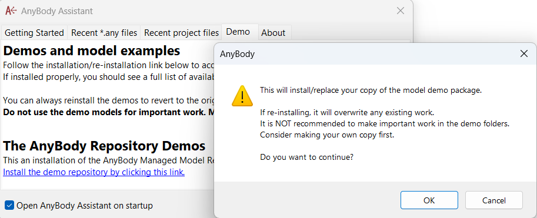

####################################
Using the AMMR
####################################

Installing
====================================

The newest version of the *AnyBody Model Repository* (AMMR) comes bundled with the 
AnyBody Modeling System. 

.. note:: The Repository files are not installed during the AnyBody installation
    because they must be available independently (not shared) for every user
    of the computer

.. rst-class:: centered

**STEP 1** 

To get a fresh copy of the AMMR select the "Demo" tab in the AnyBody Assistant
window that opens when AnyBody starts: 

.. image:: _static/Installation-anybodyassistent.png
    :width: 400
    :align: center

.. rst-class:: centered

**STEP 2**

Then select the "Install demo repository..."

This installs the repository into your Documents folder (e.g. |AMMR_DEMO_INST_DIR|). Next make a copy 
these files before you start working. 

.. danger:: The AnyBody Modeling System also comes with a version of AMMR preinstalled in
    the installation directory [#f1]_. Do not use this repository for your
    actual work. It may be overwritten without warning when AnyBody is reinstalled. Instead,
    install your own copy with the AnyBody Assistent or manually make a copy
    into your document folder.

.. todo::

    Add Best practice for working with the AMMR. Eg. using Git for version control etc.

Understanding the AnyScript Models
=====================================

.. Model Structure
.. ======================================

Most examples and application you will encounter in the *AnyBody Model Repository* use the Human Model in one way or another. 

Even thought the models wary greatly in complexity they mostly follow this common structure:

.. code-block:: AnyScriptDoc

    #include "path_to_AMMR/libdef.any"

    Main =
    {
      // Configure and include the Human Model
      #define BM_LEG_MODEL _LEG_MODEL_TLEM2_
      #define BM_ARM_LEFT OFF
      #define BM_ARM_RIGHT OFF
      #include "<ANYBODY_PATH_BODY>/HumanModel.any"

      // Compose the model
      AnyFolder Model =
      {
        AnyFolder& Body = .HumanModel.BodyModel;
        AnyFolder Drivers = {...};
        AnyFolder Environment = {...};
      };

      // Configuring  the Study
      AnyBodyStudy Study =
      {
        Gravity = {0,-9.81,1}; // Gravity Vector
        AnyFolder &Model= Main.Model;
      };
    };

.. ``#include "libdef.any"``
.. ---------------------------------

Including ``"libdef.any"`` 
---------------------------------------

All models must have the ``#include "<path to the AMMR>/libdef.any"``. This will
instruct AnyBody to use a particular AMMR.

You can place your models anywhere on your computer, as long as you include the
``libdef.any`` file found in the top level folder of the AMMR.

.. ``#define "BM_*"``
.. ----------------------------------------------------

Configuring  the Human Model
-------------------------------------------

The HumanBody Model is configured through a number of ``#define`` and ``#path``
statements. These configuration are all prefixed with ``BM_`` (e.g. ``#define
BM_ARM_RIGHT OFF`` to disable the right arm).

If no configuration parameters are given, the full body model is loaded (the default configuration). 

.. seealso:: :doc:`The documentation on BM configuration </BM_Config/index>`

.. ``#include "HumanModel.any"`` 
.. -------------------------------------------------

Including the ``HumanModel`` 

After the ``BM_*`` parameters we can include the Human Model. This with a single line:

``#include "<ANYBODY_PATH_BODY>/HumanModel.any"``

.. ``AnyFolder Model``
.. ------------------------------------

Compsing the Model
---------------------------------------

Most examples have a section where the model is composed. This is where we combine the ``Body`` from the HumanModel, and add extra things like drivers, external loads, and constraints. 

It could also be any models of the environment which the body interacts with.

.. ``AnyBodyStudy``
.. -------------------------------

The Study section
-------------------------------

The ``AnyBodyStudy`` is where you configure and define your simulation. It
specificies start and end times of the simulation, and number of steps. It also
configures which solvers are used. 

Only the model elements which are referenced from within the Study, will be included in
the simulation. In this case everything in ``Main.Model`` folder is part of the simulation.

.. rubric:: Footnotes

.. [#f1] The preinstalled and (read only) AMMR is located in: ``C:/Program files/AnyBody Technology/AnyBody_X.X/AMMR`` 
