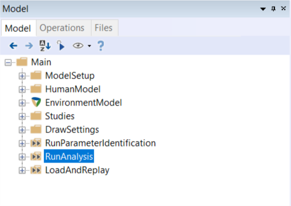

.. _anymocap:

######################
The AnyMoCap Framework
######################

The AnyMoCap model is an effort to create a simple and unified framework for
doing any kind of mocap analysis with the `AnyBody Modeling
System <http://anybodytech.com>`__.

.. image:: /_static/anymocap.jpg
    :width: 50%
    :align: center

Features
********
* Adapts to any Mocap protocol 
* Optimization of marker locations and anthropometrics. 
* Support Marker based (C3D) and inertial based (BVH) input.
* Support for standard force plates: (Types 1-4) plus more.
* :doc:`Prediction of ground reaction forces <grf-prediction>`
* Easy setup with multiple trials and subjects

.. toctree::
    :maxdepth: 2
    :hidden:

    grf-prediction

Over determinate kinematic analysis
*************************************

Musculoskeletal models that use Motion capture data are different from other
types of models found the AMMR.  Most importantly, MOCAP models usually require
an over-determinate kinematic solver to handle the excess in information that
the optical markers provide. 

The over-determinate solver in AMS works great, but
it can only find velocities and accelerations numerically. That has some
performance issue when running inverse dynamics analysis. To overcome the
problem, the MOCAP analysis is split into a two-step procedure, as illustrated on
the figure below:

.. _AnyMoCap-flow-figure:

.. figure:: /Applications/Mocap/anymocap_flow.png

   Figure 1: The framework of the AnyMoCap model. Analysis is split into three
   steps. *Parameter identification*, *Marker tracking*, *Inverse dynamic
   analysis*.

The over determinate kinematic analysis solves the model for positions, and
writes joint angles to a a set of files. These joint angles can then be used
with the determinate kinematic solver in the inverse dynamic analysis.

.. seealso:: The AnyBody tutorials, and the lesson on using the 
    :doc:`AnyMoCap model <tutorials:Making_things_move/lesson5>`

AnyMoCap examples
***********************

The following gallery shows different examples using the AnyMoCap framework. 

.. include:: /auto_examples/backreferences/gallery.anymocap.examples
.. raw:: html

    

.. note:: The *Multi trial MoCap model* is likely the best starting point when
          working with many trials/subjects from a MoCap experiment. 

Getting started
**********************

The easiest way to get started, is to adapt one the example application above. 

A typical application using the AnyMoCap framework will look something like this:

.. code-block:: AnyScriptDoc
   :linenos:

    #include "../libdef.any"

    #path MOCAP_TRIAL_SPECIFIC_DATA "TrialSpecificData.any"
    #path MOCAP_SUBJECT_SPECIFIC_DATA "SubjectSpecificData.any"
    #path MOCAP_LAB_SPECIFIC_DATA "LabSpecificData.any"

    // Include the AnyMoCap Framwork
    #include "<ANYMOCAP_MODEL>"

You can place this main file anywhere on your computer as long the
``libdef.any`` file points to model repository (AMMR) you want to use. 

.. caution:: It is recommended *not* to place working models inside the AMMR folder.
             Copy the example elsewhere before using.

Options and settings
**********************

The *AnyMoCap* framework is controlled by a number of ``#define``  and ``#path``
statements which usually prefixed with ``MOCAP_``. This is very similar to how
the :doc:`human model is configured </bm_config/index>` with ``BM_`` statements.
See the following for a overview of the options available:

.. toctree::
    :maxdepth: 1

    model-options

Model structure
**********************

When loading the AnyMoCap model the following layout shows up in the model tree:

.. rst-class:: plain

.. table:: Top-level model structure

    ======================================= ==============================================================================================
    Folder name                             Description                                                                                  
    ======================================= ==============================================================================================
    ``ModelSetup``                          Contains contains all the machinery of the AnyMoCap Frame (:doc:`see here for details <model-structure>`).    
    ``HumanModel``                          Contain the Human model used. This is constructed automatically by the AnyMoCap framework.    
    ``Main.EnvironmentModel``               Contains the model parts which are not part of the Human model. (e.g.  force plate and environment) 
    ``Studies``                             Contains the three studies ``ParameterIdentification``, ``MarkerTracking``, and
                                            ``InverseDynamicStudy``. See :ref:`figure 1 <AnyMoCap-flow-figure>`. 
    ``DrawSettings``                        Contains visual and color settings for the model. 
    ``RunParameterIdentification``          Operation to run the Parameter Identification study and save the results.                     
    ``RunAnalysis``                         Operation to 1. load the optimized parameters (scaling and marker positions), 2. run marker 
                                            tracking and finally 3. run inverse dynamics analysis, 4. save results to and HDF5 file for later replay.
    ``LoadAndReplay``                       This loads any previously saved data and starts the replay operation.
    ======================================= ==============================================================================================

The ``Main.ModelSetup`` folder contains the main machinery of the *AnyMoCap*
framework. It has a number of settings which can be overridden. The following
gives a overview of the ``ModelSetup`` folder structure and the variables which
can be configured: 

.. toctree::
    :maxdepth: 1

    model-structure

More resources
**********************

This section contains further documentation on the AnyMoCap framework. 

.. toctree::
    :maxdepth: 1

    grf-prediction
