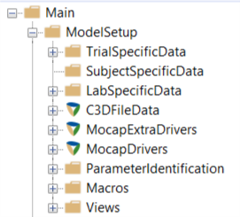

Overview of AnyMoCap model structure
#####################################

The ``Main.ModelSetup`` folder contains all the machinery of the AnyMoCap
framework. It has three important subfolder (``TrialSpecificData``,
``SubjectSpecificData`` and ``LabSpecificData``).

 These three folders contain variables specific to the application but also has
 a few variables which can be assigned directly by the user. 

.. table:: Variables in the ``Main.ModelSetup.TrialSpecificData`` folder

    ======================================= ============================================================================================== ========================================
    Name                                    Description                                                                                     Default value
    ======================================= ============================================================================================== ========================================
    ``TrialFileName``                       Name of the current trial. This is usually used for naming output files and                     Name of the main-file directory
                                            locating the input c3d files (c3d filename without the extension)
    ``LoadParametersFrom``                  List of trial names from which the scaling and optimized marker postions are loaded from.       ``{TrialFileName}``        
    ``FirstFrame``                          First frame of the C3D/BVH file to use as starting frame in the analysis                        First frame in the C3D/BVH file
    ``LastFrame``                           The last frame of the C3D/BVH file to use in the analysis                                       Last frame in the C3D/BVH
    ``tStart``                              Specifies the start time of the analysis. Setting this overides ``FirstFrame``                  Calculated based on ``FirstFrame``
    ``tEnd``                                Specifies the end time of the analysis. Setting this overides ``LastFrame``                     Calculated based on ``LastFrame``
    ``nStep``                               Number of time steps used in the analysis. (Note that the number of time-steps in the inverse   Calculate based on ``tStart``/``tEnd``
                                            dynamic analysis will be 4 less than this values)
    ======================================= ============================================================================================== ========================================

.. table:: Variables in the ``Main.ModelSetup.SubjectSpecificData`` folder

    ======================================= ============================================================================================== ========================================
    Name                                    Description                                                                                       Default value
    ======================================= ============================================================================================== ========================================
    _                                       Usually only contain custom values specific to the application.                                None
    ======================================= ============================================================================================== ========================================

.. table:: Variables in the ``Main.ModelSetup.LabSpecificData`` folder

    ======================================= ============================================================================================== ========================================
    Name                                    Description                                                                                       Default value
    ======================================= ============================================================================================== ========================================
    ``Gravity``                             Specifies the gravity vector in global reference frame.                                         ``{0,0,-9.81}``
    ``LowPassFilterSettings``               Folder with filter settings used for markers and analog (force) data. 
    ``.MarkerFilterCutOffFrequency``        The lowpass cutoff frequency used for the marker data.                                          ``5.0``
    ``.MarkerFilterOrder``                  The filter order used when low pass filtering the marker data.                                  ``2``
                                            Note: Since the filter is applied as a zero phase filter
                                            (**filtfilt** or forward/backward filter) the effective filter order is the
                                            double of this value. 
    ``.ForceFilterCutOffFrequency``         The lowpass cutoff frequency used for the force/analog data.                                   ``12.0``
    ``.ForceFilterOrder``                   The filter order used when low pass filtering the force/analog data.                           ``2``
                                            Note: Since the filter is applied as a zero phase filter
                                            (**filtfilt** or forward/backward filter) the effective filter order is the
                                            double of this value. 
    ======================================= ============================================================================================== ========================================

