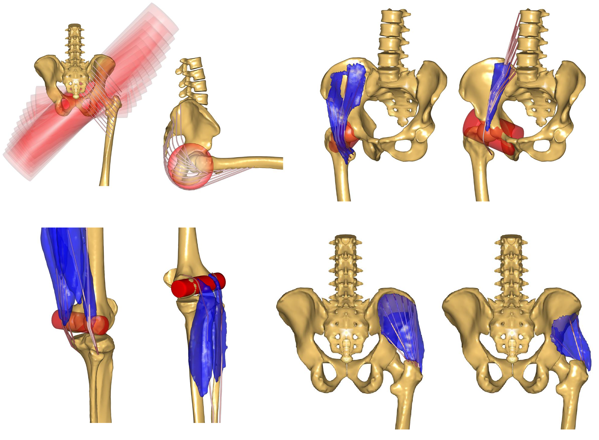

Twente Lower Extremity Model v.2.1
==================================

The Twente lower extremity model version 2 (TLEM2) is a successor to the TLEM
model documented `here <Leg-TLEM_model.html>`__. It contains **6 DOF** and **169
muscles**.

.. raw:: html 

    <video width="45%" style="display:block; margin: 0 auto;" controls autoplay loop>
        <source src="../_static/TLEM2_rotating_model.mp4" type="video/mp4">
    Your browser does not support the video tag.
    </video>

The model is based on published anatomical data produced from a cadaver study in
the `TLEMsafe EU project <https://www.tlemsafe.eu/>`__ (see the study by Carbone
et al. at the University of Twente, The Netherlands). The first implmentation of
the musculoskeletal model was created by Vincenzo Carbone and René Fluit from
the University of Twente [CFPK15]_.

After the TLEMSafe project the model was futher refined
in the `Life
Long Joints project <https://lifelongjoints.eu/>`__ where its anatomical
fidelity and joint force prediction accuracy were improved by De Pieri et al.
[DLGR17]_, resulting the version 2.1 which was integrated here in the AMMR. 

Key feature of this TLEM 2.1 model in the AMMR is:

*   Unlike the old TLEM model, the dataset consisted of muscle attachment data &
    bone surface scans from the same subject. This makes TLEM2 the more
    anatomically consistent model. Bone contact at joints such as the knee thus
    consists of naturally congruent surfaces, making it easier to implement
    Force Dependent Kinematics on joint moments (:tutorials:doc:`see tutorial <ForceDependentKinematics/index>`)
*   Updated the wrapping surfaces for several muscles. These changes were engineered to 
    result in realistic muscle coordination and hip contact forces as documented
    in the publication by De Pieri et al. [DLGR17]_

    *New wrapping surfaces for (clockwise) Gluteus maximus, Ilio-Psoas, Gluteus
    medius & minimus, Hamstrings & Gastrocnemius (version 1.2). All figures are
    from the publication by De Pieri et al. [DLGR17]_*

Example Configuration
-----------------------

Short example of how to configure the model with the TLEM model, Hill type
muscle model and only one leg:  

.. code-block:: AnyScriptDoc

    #define BM_LEG_MODEL _LEG_MODEL_TLEM2_
    #define BM_LEG_RIGHT ON
    #define BM_LEG_LEFT OFF
    #define BM_LEG_MUSCLE _MUSCLES_3E_HILL_

.. rst-class:: float-right

.. seealso::
   
   See :doc:`Leg configuration parameters <../bm_config/leg>` for a
   full list of configuration parameters or :doc:`configuration section <../bm_config/index>`
   for more information on BM parameters.

Resources
-----------------------

More details on the TLEM2 model can be found online:

- Webcast: `TLEMsafe: Personalization of musculoskeletal models and prediction of functional outcome <https://www.anybodytech.com/downloads/documentation/#20150903>`__

- Webcast: `TLEMsafe: An integrated system to improve predictability of functional recovery of patients requiring musculoskeletal surgery <https://www.anybodytech.com/downloads/documentation/#20130305>`__

References
-----------------------

If you need to cite the model use the following references: 

.. [DLGR17] De Pieri,E., Lund,ME., Gopalakrishnan, A, Rasmussen, KP., Lunn, DE., Ferguson, SJ.
   “Biofidelic Muscle Wrapping in a Musculoskeletal Model Improves Hip Contact Force Prediction Accuracy”
   PlosOne (2017) **Submitted**

.. [CFPK15] Carbone,V., Fluit,R., Pellikaan,P., van der Krogt,MM., Jansen,D., Damsgaard,M., 
   Vigneron,L.,Feilkas,T., Koopman,HF., Verdonschot,N., 
   "Tlem 2.0–A comprehensive musculoskeletal geometry dataset for subject-specific 
   modeling of lower extremity", J. Biomech.,48(5) (2015) 734-741.   

Other usefull papers using or related to the TLEM2 model are: 

.. [Ca16] Carbone,V., "Subject-specific lower extremity modeling: personalization of 
   musculoskeletal models using medical imaging and functional measurements", 
   PhD thesis, University of Twente, Netherlands (2016).

.. [CKKV16] Carbone,V., van der Krogt,MM., Koopman,HF., Verdonschot,N., "Sensitivity of subject-specific 
   models to Hill muscle-tendon model parameters in simulations of gait", 
   J. Biomech.,49 (2016) 1953-1960.