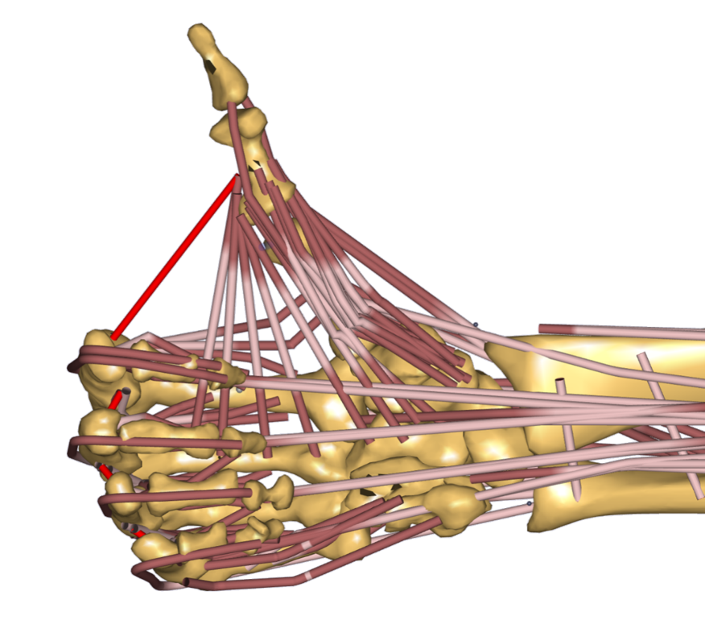
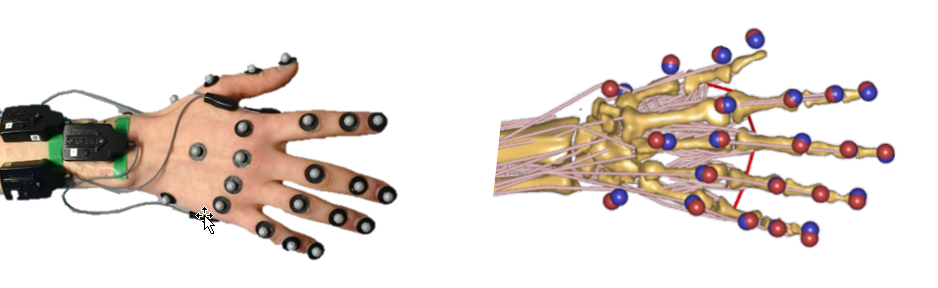

Regensburg-Ulm Hand Model (RUHM) 
================================

.. rst-class:: without-title

.. caution:: **Unreleased model:** The model is under development and not yet included in the managed model repository. 
   The model is used in various research projects and access to the development version
   can be given on request. 

The Regensburg-Ulm hand model (RUHM) is a detailed
hand model which includes all extrinsic and intrinsic muscles using data
from an anatomical study by Havelková et al. [HAZI20]_ (Charles University, Pilsen) of 16 cadaveric forearms. 

The hand model consists of 22 hand segments
(including ulna and radius) modelled as rigid bodies
linked by physiological idealized joints giving a total of 31 DOF.
For the sake of reduced complexity the carpal bones where treated as one rigid body.

The Regensburg-Ulm-Hand-Model was developed by Lucas Engelhardt and Maximilian Melzner [EMHF20]_
from Ulm University and OTH Regensburg respectively. 

.. EMBED a rotatable 3D version of the hand model.
.. .. raw:: html 
..     <video width="45%" style="display:block; margin: 0 auto;" controls autoplay loop>
..         <source src="../_static/TLEM2_rotating_model.mp4" type="video/mp4">
..     Your browser does not support the video tag.
..     </video>

.. The model was Lorem ipsum dolor sit amet, consectetur adipiscing elit, sed do
.. eiusmod tempor incididunt ut labore et dolore magna aliqua. Ut enim ad minim
.. veniam, quis nostrud exercitation ullamco laboris nisi ut aliquip ex ea commodo
.. consequat. Duis aute irure dolor in reprehenderit in voluptate velit esse cillum
.. dolore

.. Example Configuration
.. -----------------------

.. Short example of how to enable the the model:  

.. .. code-block:: AnyScriptDoc

..     #define BM_HAND_MODEL  _HAND_MODEL_RUHM_ 

.. You can directly specify the posture of the 
.. detailed hand model by setting the values  in ``Main.HumanModel.Mannequin``:

.. .. code-block:: AnyScriptDoc

..     HumanModel.Mannequin.Posture.Right = {
..       Finger1 = 
..       {
..          CMCAbduction = 10;
..          CMCFlexion = 40;
..          MCPFlexion = 55;
..          MCPAbduction = 0.0;
..          DIPFlexion = 20;
..       };
..       Finger2 =
..       {
..         MCPFlexion = 10;
..         PIPFlexion = 10;
..         DIPFlexion = 5;
..       }; 
..     };

.. .. rst-class:: float-right

.. .. seealso::

..    The :doc:`Leg configuration parameters <../bm_config/leg>` for a
..    full list of configuration parameters.
.. rst-class:: without-title

References
-----------------------

If you need to cite the model use the following references: 

.. [EMHF20] Engelhardt, L., Melzner, M., Havelkova, L. & Fiala, P. 
   A new musculoskeletal AnyBodyTM detailed hand model i. Journal of Computer Methods in Biomechanics and Biomedical Engineering (2020) 
   doi: 10.1080/10255842.2020.1851367

.. [HAZI20] Havelková L., Zítka T., Fiala P., Rybarova M., Tupý R., Kalis V., & Ismail K.M. (2020). 
   Data for: Hand muscles attachments: A Geometrical model (Version pre pub sc v1.1) [Data set]. Zenodo. 
   (`link <http://doi.org/10.5281/zenodo.3954024>`__)
