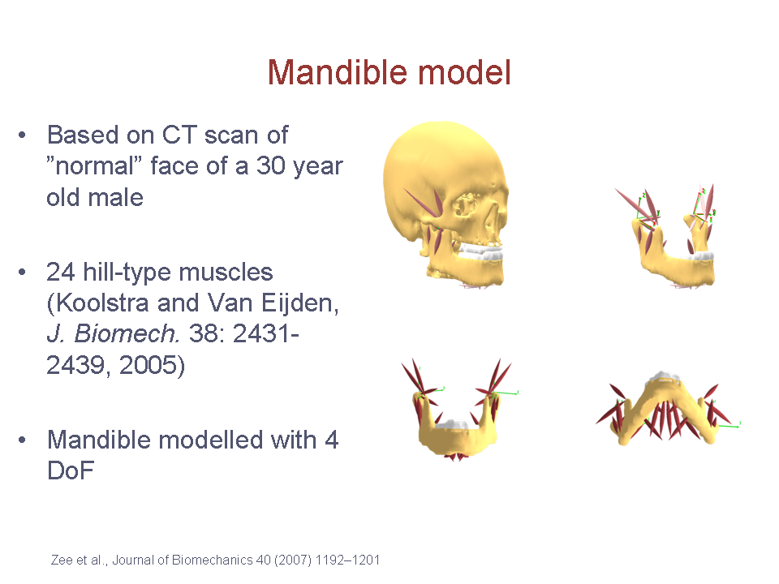

# The Symmetric Mandible

% Are there more stuff we can write about the mandle model.
% I think we should also add more images.

This mandible model is based on CT scans of a ”normal” face of a
30-year-old male. It contains 24 hill-type muscles and 4 DoF. It was
developed by Dr. Mark de Zee at Aarhus University, Denmark and
[published](https://pubmed.ncbi.nlm.nih.gov/16930608/)
and presented at several scientific meetings. [^cite_dezee2007]

:::{seealso}
{ref}`example_mandiblemodel` for an
example of how the model is used.
:::

```{eval-rst}
.. todo::  Add a short example on how the mandible model is used and configured.
```



```{rubric} References
```

[^cite_dezee2007]: Mark de Zee, Michel Dalstra, Paolo M Cattaneo, John Rasmussen, Peter
    Svensson, Birte Melsen (2007). Validation of a musculo-skeletal model
    of the mandible and its application to mandibular distraction
    osteogenesis. *Journal of Biomechanics*, 40, 1192–1201.
