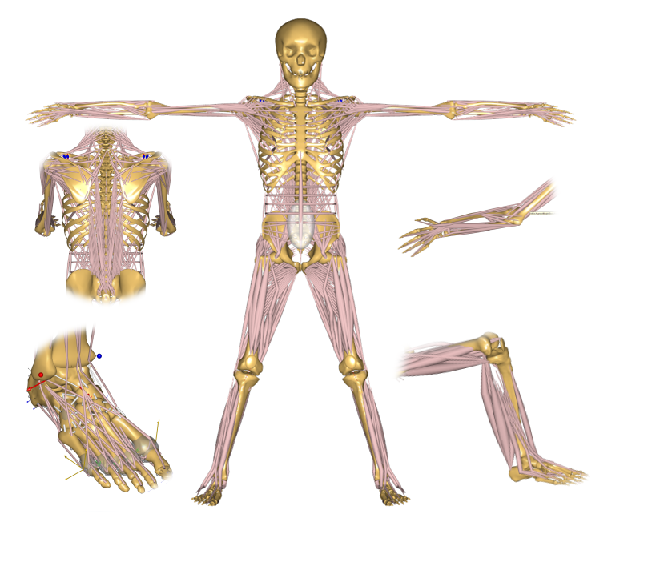

.. AMMR documentation master file, created by
   sphinx-quickstart on Wed Aug 23 14:56:19 2017.
   You can adapt this file completely to your liking, but it should at least
   contain the root `toctree` directive.

Welcome to AMMR's documentation!
=======================================

The AnyBody Model Repository (AMMR [#f1]_ ), is an open library of
musculoskeletal models and examples ready to be used with the `AnyBody Modeling
System`_. 

   The AnyBody Model Repository is a unique open collection of human body parts.

The models are developed in research projects at academic institutions or by
AnyBody Technology in collaboration with academic institutions. The models are
maintained by AnyBody Technology who ensures various body part models can
be used together as full body scalable musculosketeal model.

.. _AnyBody Modeling System: https://www.anybodytech.com/software/ams/

Installation
------------

.. toctree::
    :maxdepth: 2

    Installation

Using the AMMR
--------------
.. toctree::
    :maxdepth: 1

    Creating_model_from_scratch
    HumanBody_configurations

Model Overview
--------------

.. toctree::
    :maxdepth: 2

    Examples_and_applications
    BodyModels/BodyParts_and_models

Development
-----------

.. toctree::
    :maxdepth: 2

    Contribute

Indices and tables
------------------

* :ref:`genindex`
* :ref:`search`

.. rubric:: Footnotes

.. [#f1] The double *M* in the *AMMR* comes from the repository sometimes
    beeing refered to as the "AnyBody Managed Model Repository". 
    You may call it what you like. 

